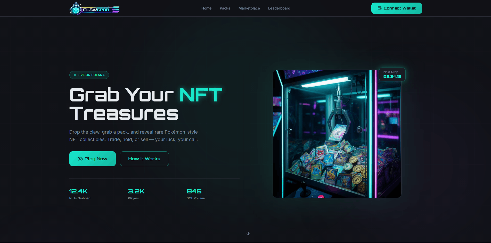
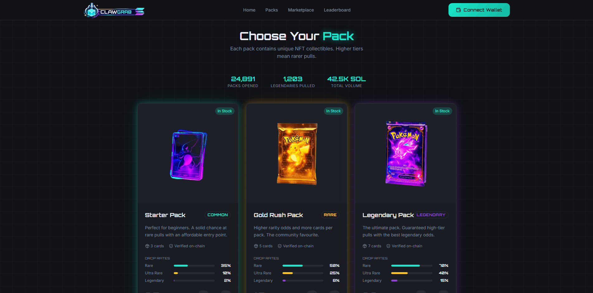
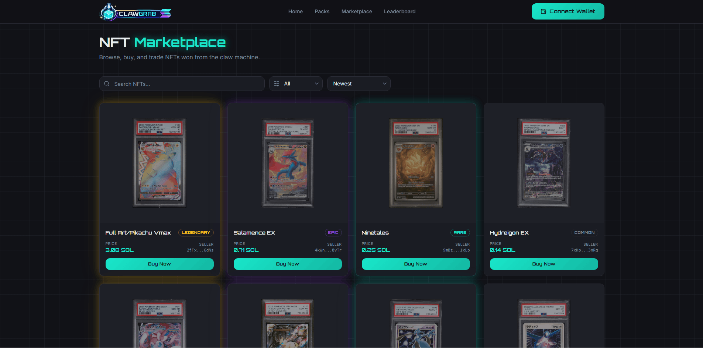
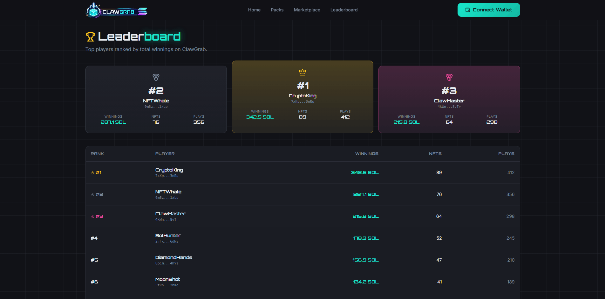

# 🕹️ ClawGrab

> **Drop the claw. Grab the pack. Reveal the treasure.** 🎰

**ClawGrab** is a claw-machine style NFT collectibles web app on **Solana** ⚡. Connect your wallet, drop the claw on a pack, and reveal rare Pokémon-style NFT cards — then **trade**, **hold**, or **sell** on the marketplace. Your luck, your call. 🍀


[](https://t.me/TopTrenDev_66)
[](https://x.com/intent/follow?screen_name=toptrendev)

---

## ✨ Screenshots

### 🏠 Home — Grab Your NFT Treasures


### 📦 Packs — Choose Your Odds
Starter, Gold Rush, and Legendary packs with different rarity drop rates — all priced in SOL.


### 🛒 Marketplace — Buy & Trade NFTs
Browse graded collectibles, filter by rarity, and buy from other players.


### 🏆 Leaderboard — Top Players
See who's winning the most SOL and collecting the rarest pulls.


---

## 🎯 Features

- **🏠 Home** — Hero, featured packs, how it works, and live recent pulls
- **📦 Packs** — Buy Starter, Gold Rush, and Legendary packs (priced in SOL) with tiered rarity odds
- **🛒 Marketplace** — Browse, filter, search, and trade NFTs won from the claw machine
- **🏆 Leaderboard** — Top players ranked by total winnings, NFTs collected, and plays

## 🎮 How It Works

1. **🪝 Drop the Claw** — Connect your Solana wallet and choose a pack
2. **🎁 Reveal Your Pull** — Watch the claw grab your NFT and reveal the card rarity
3. **💎 Collect or Trade** — Keep your NFT, list it on the marketplace, or trade with others
4. **🔄 Sell Back** — Don't want it? Sell back at 85% instant buyback value

---

## 🛠️ Tech Stack

- **Runtime** — [Vite](https://vitejs.dev/) 5, [React](https://react.dev/) 18, [TypeScript](https://www.typescriptlang.org/)
- **UI** — [Tailwind CSS](https://tailwindcss.com/), [Framer Motion](https://www.framer.com/motion/), [Lucide](https://lucide.dev/) icons
- **Routing** — [React Router](https://reactrouter.com/) v6

## 📋 Prerequisites

- [Node.js](https://nodejs.org/) (LTS recommended)
- npm (or pnpm/yarn)

## 🚀 Getting Started

```bash
# Install dependencies
npm install

# Start dev server (with HMR)
npm run dev
```

Dev server runs at **http://localhost:8080** (or the port shown in the terminal).

## 📜 Scripts

| Command | Description |
|--------|-------------|
| `npm run dev` | Start Vite dev server |
| `npm run build` | Production build |
| `npm run build:dev` | Build in development mode |
| `npm run preview` | Preview production build locally |
| `npm run lint` | Run ESLint |
| `npm run test` | Run Vitest once |
| `npm run test:watch` | Run Vitest in watch mode |

## 📁 Project Structure

```
src/
├── main.tsx           # Entry, React root
├── App.tsx            # Routes
├── index.css          # Global styles, Tailwind
├── pages/             # Route pages
│   ├── Index.tsx      # Home
│   ├── Packs.tsx      # Pack store
│   ├── Marketplace.tsx
│   ├── Leaderboard.tsx
│   └── NotFound.tsx
├── components/        # Shared & page-specific components
│   ├── Navbar.tsx
│   ├── Footer.tsx
│   ├── HeroSection.tsx
│   ├── PacksSection.tsx
│   ├── HowItWorks.tsx
│   └── RecentPulls.tsx
└── data/              # Local card & game data
```
